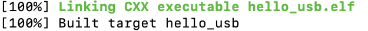
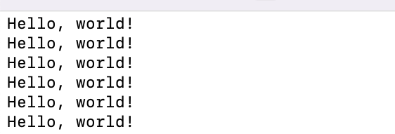

## ESE 519 Lab 2A Setup Guide
Name: James Ciardullo

Dev environment: 2019 16-inch MacBook Pro, MacOS Monterey 12.6

Note: I had homebrew, cmake, and the gcc compiler already installed on my computer from previous developmental projects. If you are certain you have these installed and up to date, feel free to skip to step 3.

### 1. Installing Homebrew
     $ /bin/bash -c "$(curl -fsSL https://raw.githubusercontent.com/Homebrew/install/HEAD/install.sh)""
   
### 2. Installing toolchain
     $ brew install cmake
     $ brew tap ArmMbed/homebrew-formulae
     $ brew install arm-none-eabi-gcc
     
### 3. Cloning the Pico-SDK Repository
Make a working directory for lab 2 to hold the following repository files:
	 
	 $ mkdir ese519lab2
     $ cd ese519lab2
     
Then clone the appropriate repositories:
     
     $ git clone https://github.com/raspberrypi/pico-sdk.git
     $ cd pico-sdk
     $ git submodule update --init
     $ cd ..
     $ git clone https://github.com/raspberrypi/pico-examples.git

### 4. Downloading CLion
I used [CLion](https://www.jetbrains.com/clion/) as my IDE.

### 5. Build hello\_usb.c
Navigate to the pico-sdk folder and replace the string in the following command after the "=" with your pico-sdk path:
	 
	 $ export PICO_SDK_PATH="/Users/ese519user/pico-sdk"
	 	
Copy and paste the hello_usb.c file from pico-examples into your directory. Call the following command in a new terminal at the working directory to make a new build subdirectory:

     $ mkdir build
     $ cd build
     
      
Execute the cmake command and then make the executable with the appropriate flag:

     $ cmake ..
     $ make -j4

Fix any errors with the code if applicable, then remake. The final message displayed in the terminal should say "Built target hello_usb" as such:

### 6. Execute hello\_usb.c
After connecting the RP2040 board, press and hold both the boot and reset buttons for a few seconds. Then drag the hello_usb.uf2 file from the build directory onto the device.

Open a new terminal and execute the following command:

     $ ls /dev/tty.usbmodem*
     
There should only be one port that matches this name, use it in the next command:

     $ screen /dev/tty.usbmodem...

The expected behavior should be the "Hello, world!" outputted to the terminal:

